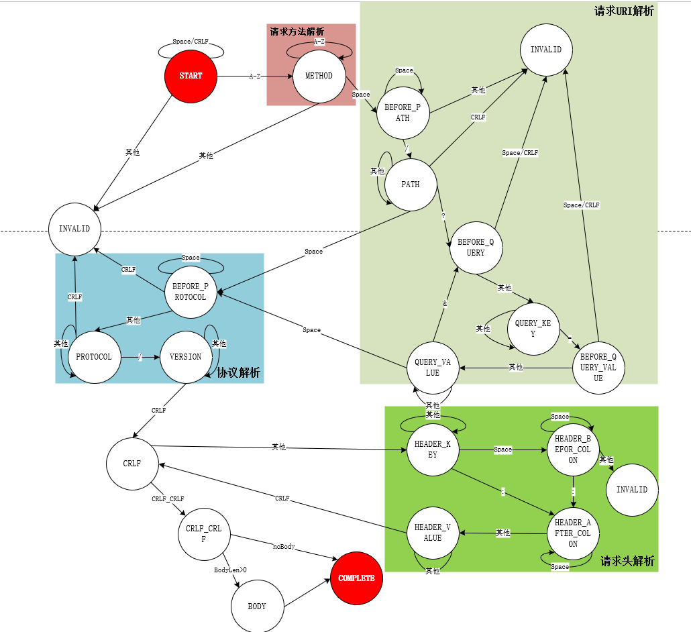

# 环境和测试操作
本服务器框架基于Linux\C++11实现，快速测试步骤：
- 编译框架源文件：会生成对应得`libTrluper.so`库文件和各可执行文件
```
cd TEST
cmake ..
make
```

- 生成客户端可执行文件
```
cd client\build
cmake ..
make
```


# 目录结构
- **目录结构介绍：**
	- `include`：框架声明的头文件，后续所有的抽象类和继承类头文件
	- `src`:放置框架的源文件
	- `build`:放置框架构建好的文件
	- `test`:放置测试代码
	- `TEST`:放置测试的`debug`文件
	- `client`存放客户端代码
```
.
├── CMakeLists.txt
├── client
├── TEST
├── build
├── include
├── lib
├── src
└── test
```


# 框架介绍
该服务器框架是基于epoll和socket技术的基础上实现的一个并发tcp_server框架。该框架采用三层结构的设计思想，实现服务器对客户端请求处理过程的解耦合。三层结构为连接层`Connections`、数据处理层`DataProcess`和业务应用层`FApplycations`。

此外，还集成了**路由功能**；封装**线程、锁和信号量**等调用模块和**线程池管理**；配备了**日志系统`log`**；配备了**定时器`Timer`**模块；支持**`TCP/HTTP`协议**，以提供快速部署高性能的TcpServer和HTTPServer的能力

开发可以基于此框架开发自己的WebServer和其他相关服务器，也可以通过实现该框架加深对后端知识的理解。

# 三层结构


## 三层架构功能概括及处理流程
- `Server`：负责对`Server`服务器的初始化工作，如创建`Socket`、`epoll`和是否启动线程池、执行监听等操作，监听触发：
	- 当`Server`异步监听到一个连接请求后会调用一个`CreateAllObjWhenAccept`纯虚函数（需要实现），会创建该连接自己的`Connections`对象、`DataProcess`对象、`FApplycations`对象并一一绑定。
	- 监听若是是数据读写操作后，交由`Connections`层处理
- `Connections`连接层：**负责对已经建立连接的`Socket`文件描述符执行接收数据、发送数据功能**。
	- 若为接收数据，接收数据后会向绑定的`DataProcess`传输；
	- 若为发送，则向客户端发生数据。
- `DataProcess`数据处理层：**主要负责对数据格式的解析**，在这一层设用在可以设计自己的数据协议解析操作(如设计`TLV`形式的数据协议解决TCP粘包、如使用protobuf序列化技术等均可支持)；同样当业务应用多时，可通过实现路由`Router`功能进行寻找，防止因责任链过于冗长而耗时。
	- 对于来自`Conections`的数据，执行相应的数据处理操作后，交给指定的业务层对象`FApplycations`
	- 对于来自`FApplycations`的数据，执行相应的反数据处理后，交给该连接的`Connections`处理
- `FApplycations`应用层：**由应用开发者实现一些业务应用**。也可配备路由模块`Router`执行业务路由寻址。

## 三层需实现的纯虚函数
开发者若要使用该框架，**必须**继承实现这三层并至少实现以下**纯虚函数**：
- `Connections`连接层：只需要实现一个纯虚函数：**`GetDataProcessObj(Message& msg)`**。
	- `virtual DataProcess* GetDataProcessObj(Message& msg)`:返回一个`DataProcess*`对象指针。
- `Dataprocess`数据处理层：需要实现`GetConnectionsObj`、`GetApplycationsObj`、`MsgToRequest`、`RequestToMsg`四个纯虚函数:
	- `GetConnectionsObj`：返回一个`Connections*`，用于指示数据由谁发送
	- `GetApplycationsObj`：返回一个`FApplycations*`对象，用于指示数据交给哪个业务对象。
	- `Request* MsgToRequest(Message& msg)`：将连接层递交上来的`message`处理为`Request`类型，即数据处理为`Request`请求后交给业务层
	- ` Message* RequestToMsg(Request& request)`：将应用层递交下来的`Request`类型的数据转为`Message`类型
- `FApplycations`应用层：需要实现` ProcRequest`和`GetNextApplycationsObj`两个纯虚函数：
	- `Request* ProcRequest(Request& _request)`：当前业务对象处理请求的函数，內部实现业务处理逻辑；若还需要进一步处理，则需要返回相关的请求`Request*`信息（堆对象），否则返回`nullptr`
	- `FApplycations* GetNextApplycationsObj(AbstractMsg& msg)`：下一个业务处理者处理

**tips：** 该框架定义了`AbstractMsg`抽象信息类，`Message`继承实现于它，`Message`为数据层与数据处理层的数据传输类，无需应用开发者重写实现；同时定时实现了`Request`，为数据处理层和应用层之间的数据传输类，需要开发者重新实现自己的`request`。

## 快速开始
此节示例一个简单C/S回显功能：
- `Connections`数据层类的实现：
```
inline MyDataProcess *MyConnections::GetDataProcessObj(Trluper::Message &msg)
{
    return process;
}
```

- `DataProcess`数据处理层实现：
```
inline Trluper::Connections *MyDataProcess::GetConnectionsObj(Trluper::AbstractMsg &msg)
{
    return conn;
}

inline Trluper::FApplycations *MyDataProcess::GetApplycationsObj(Trluper::AbstractMsg &msg)
{
    return app;
}


Trluper::Request *MyDataProcess::MsgToRequest(Trluper::Message& msg)
{
    ListRequest* ret = nullptr;
    std::string& str = msg.message;
    while (1)
    {
        //8字节无法满足
        if(str.size()<8)  break;
        int id = 0;
        id |= str[0]<<0;
        id |= str[1]<<8;
        id |= str[2]<<16;
        id |= str[3]<<24;
        int bytelength = 0;
        bytelength |= str[4]<<0;
        bytelength |= str[5]<<8;
        bytelength |= str[6]<<16;
        bytelength |= str[7]<<24;
        //请求不完整
        if(str.size()-8<bytelength){
             break;
        }
        MyRequest* _request =new MyRequest((REQUEST_TYPE)id,str.substr(8,bytelength));
        lreq->lRequest.push_back(_request);
        str.erase(0,8+bytelength);
    }
    if(lreq->lRequest.empty()==false){
        ret = lreq;
    }
   
    return ret;
}

Trluper::Message *MyDataProcess::RequestToMsg(Trluper::Request &request)
{
    Trluper::Message* _CMsg =new Trluper::Message(Trluper::IO_Direction::OUT);
    DYNAMIC_GETREF(MyRequest,_outRequest,request);
    std::string str=_outRequest->ret;
    int id = _outRequest->requestType;
    int bytelength = str.size();
    _CMsg->message.push_back((id>>0) & 0xff);
    _CMsg->message.push_back((id>>8) & 0xff);
    _CMsg->message.push_back((id>>16) & 0xff);
    _CMsg->message.push_back((id>>24) & 0xff);
    _CMsg->message.push_back((bytelength>>0) & 0xff);
    _CMsg->message.push_back((bytelength>>8) & 0xff);
    _CMsg->message.push_back((bytelength>>16) & 0xff);
    _CMsg->message.push_back((bytelength>>24) & 0xff);
    _CMsg->message.append(str);
    delete _outRequest;
    _outRequest = nullptr;
    return _CMsg;
}
```

- `FApplycations`应用层实现：
```
inline Trluper::Request *MyFApplycations::ProcRequest(Trluper::Request& _request)
{
    DYNAMIC_GETREF(ListRequest,_lRequestObj,_request);
   while(false == _lRequestObj->lRequest.empty()){
        auto request = _lRequestObj->lRequest.front();
        _lRequestObj->lRequest.pop_front();
        std::cout<<"Type is: "<<request->requestType<<std::endl;
        switch (request->requestType)
        {
        case REQUEST_TYPE::REQUEST_TYPE_ECHO:
            echoFunc(request->ret);
            break;
        case REQUEST_TYPE::REQUEST_TYPE_ECHO_LEN:
            echoAndLenFunc(request->ret);
            break;
        }
        //释放数据层的分配的堆
        delete request;
    }
    return nullptr;
}

inline Trluper::FApplycations *MyFApplycations::GetNextApplycationsObj(Trluper::AbstractMsg& msg)
{
    return nullptr;
}
```

**除此以外，我们还需要实现带有`CreateAllObjWhenAccept`的工厂类，当一个连接请求带来时，应该建立好这三层对象和责任链关心，此外还需定义自己的`Request`:**

- `factory`类：
```
Trluper::Connections *Factory::CreateAllObjWhenAccept(int _dataFd)
{
    MyConnections* conn = new MyConnections(_dataFd);//8/12
    MyDataProcess* process = new MyDataProcess();//4/12
    MyFApplycations* app = new MyFApplycations();//2/12
    conn->SetDataProcessObj(process);
    process->SetConnectionsObj(conn);
    process->SetFApplycationsObj(app);
    app->SetMyDataProcessObj(process);
    return conn;
}
```

- `MyRequest`类：
```
class MyRequest:public Trluper::Request{
public:
    
    MyRequest(REQUEST_TYPE _type,std::string str);
    virtual ~MyRequest();
    

public:
    //用户的protobuf消息指针
    std::string ret;
    //定义了两种类型请求，一个是回显，一个是回显+消息长度
    REQUEST_TYPE requestType;
};
```

**上述的具体实现可看`TEST`目录下的源文件**

### 效果

- 执行可执行文件,在`TEST`目录启动测试服务器`./Server`;在client/build启动`./client`
```
trluper@Trluper:/home/project/Trluper/TEST$ ./Server 
Log pattern string initial successfully.
The configuration file was read successfully.
Configure the following server attributes:
--------------------Server Configuration--------------------
Server Host: 172.20.25.130
Server port: 8080
Number of child thread is: 8
Request cache maximum is: 8000
Read Buffer size is: 8192Byte
Write Buffer size is: 16384Byte
--------------------MySQL Configuration--------------------
MySQL Host: 172.20.25.130
MySQL Port: 3306
MySQL Username: trluper
MySQL Password: 123456
MySQL Database: test
--------------------Log Configuration----------------------
- name: root
  level: DEBUG
  formatter: "%d{%Y-%m-%d %H:%M:%S} [%c][%p] %t(%N) %f (in %F: %l): %m%n"
  appenders:
    - type: StdoutLogAppender
      level: DEBUG
--------------------Server's Log Configuration-------------
- name: root
  level: DEBUG
  formatter: "%d{%Y-%m-%d %H:%M:%S} [%c][%p] %t(%N) %f (in %F: %l): %m%n"
  appenders:
    - type: StdoutLogAppender
      level: DEBUG
    - type: " FileLogAppender"
      file: ../Log/root_info.txt
      level: INFO
    - type: " FileLogAppender"
      file: ../Log/root_error.txt
      level: ERROR
--------------------Running Log info-----------------------
2024-01-05 17:40:17 [root][INFO] 17212(Trluper-0) /home/project/Trluper/src/server.cc (in ctlAcceptFd: 261): 新的客户端连接,ip：172.20.25.130

<------------------------------------------------------------->
Type is: 1
recvfrom client: 你好
send to client:7, packetSize: 6
```


```
trluper@Trluper:/home/project/Trluper/client/build$ ./client 
1
你好
你好
```


# 日志系统
Trluper框架还配备了类似log4j风格的日志系统，即主要由日志器`logger`、`Appender`和`Formatter`构成：
- `logger`：日志器，**制日志的输出级别（默认为`DEBUG`最低级别）、输出格式和输出目的地**。`logger`支持含有多个`Appender`输出地。
- `Appender`：**控制日志被写入的目的地**，本框架实现了标准输出`StdoutLogAppender`和文件输出目的地`FileLogAppender`。
- `Formatter`：**用于定义日志输出的格式**。，其支持14种格式解析：
```
%m 消息
%p 日志级别
%r 累计毫秒数
%c 日志器名称
%t 线程id
%N 线程名称
%C 协程ID
%n 换行
%d 时间
%f 文件名
%F 函数名称 
%l 行号
%T 制表符
%% %

日志默认格式: "%d{%Y-%m-%d %H:%M:%S} [%c][%p] %t(%N) %f (in %F: %l): %m%n"
```
- `LogLevel`：日志级别一共分为`UNKNOW,DEBUG,INFO,WARN,ERROR,FATAL`六个级别，只有当日志事件等级大于等于当前日志器事件等级时才会输入到输出地。

## 日志系统的使用
该日志系统支持**流式写入**和**格式写入**两种，并搭配了各自的宏使用这两种形式的日志写入:
```
//流式写入
LOG_SS_DEBUG(logger) 	//DEBUG级别
LOG_SS_INFO(logger) 	//INFO级别
LOG_SS_WARN(logger) 	//WARN级别
LOG_SS_ERROR(logger)	//ERROR级别
LOG_SS_FATAL(logger) 	//FATAL级别
//格式写入
LOG_FMT_DEBUG(logger,fmt,...) 	//DEBUG级别
LOG_FMT_INFO(logger,fmt,...) 	//INFO级别
LOG_FMT_WARN(logger,fmt,...) 	//WARN级别
LOG_FMT_ERROR(logger,fmt,...) 	//ERROR级别
LOG_FMT_FATAL(logger,fmt,...) 	//FATAL级别
```
### 快速开始
以下是一个展示日志系统使用的简单示例
```
#include "log.h"
int main(){
	Trluper::LogggerManager* manager = LOG_GET_MANAGER(); //获取日志器管理类的单例对象的宏
	Trluper::Logger::ptr mainLogger = manager->getMainLogger();//获得主日志器，日志系统默认会创建一个名为root的主日志器
	std::string path = "../Log/log.txt";
	//创建一个FileLogAppender
	Trluper::LogAppender::ptr p(new Trluper::FileLogAppender(path));
	//设置p的日志等级为ERROR，即只有大于等于ERROR的日志事件才会写入文件log.txt中
	p->setLogLevel(Trluper::LogLevel::ERROR);
	//为该日志器添加一个FileLogAppender（默认拥有一个StdoutLogAppender)
	mainLogger->addAppender(p);
	//流式写入日志
	LOG_SS_DEBUG(mainLogger)<<"Hello Trluper log";
	LOG_SS_ERROR(mainLogger)<<"ERROR in line 61";
	//格式化写入日志
	LOG_FMT_DEBUG(mainLogger,"This is %s, Line:%d","Trluper log",61);
	return 0;
}
```

## 使用注意
 1. 你可使用`manager->getLogger(name)`创建你自己的日志器，他会返回一个`Logger::ptr`类型的值，这里我们定义为`mylogger`
 2. 在你进行写入日志内容前，你需要为`mylogger`添加输出地`Appender`（本框架实现了标准输出`StdoutLogAppender`和文件输出目的地`FileLogAppender`,你也可以自定义实现`Appender`)，同时为定义输出格式`Formatter`。
	1. 添加输出地：`addAppender()`函数
	2. 删除输出的：`delAppender`
	3. 清除输出地：`clearAppenders`
	4. 设置格式模板由两个重载函数：`setFormatter`。**注意：logger调用`setFormatter`设置的格式模板会将其拥有有的`Appenders`的格式模板都设置.**
 3. 你可以调用`setLogLevel`设置`mylogger`的日志级别，**注意：logger调用`setLogLevel`设置的日志级别会将其拥有有的`Appenders`对象的日志级别都设置为该级别.**
 4. 若不想Logger中所有的`Appender`都统一设置`level`和`Formatter`，可以调用`Appender`的`setFormatter`和`setLogLevel`进行独立设置，此时日志的写入会依据`Appender`的设置级别和格式器决定是否写入，以什么格式写入。

## 当前所有日志器的配置情况
日志系统配备了YAML以快速获取日志系统目前的所有配置情况：
- 日志管理器对象`manager->->toYAMLString()`即可获得当前配置,示例`LOG_SS_DEBUG(mainLogger)<<"\n"<<lm->toYAMLString();`:
```
2023-12-04 18:13:17 [root][DEBUG] 748(Trluper) /home/project/Trluper/test/test_log.cc (in main: 19): 
- name: system
  level: DEBUG
  formatter: "%d{%Y-%m-%d %H:%M:%S} [%c][%p] %t(%N) %f (in %F: %l): %m%n"
  appenders:
    - type: " FileLogAppender"
      file: ../Log/log.txt
      level: ERROR
- name: root
  level: DEBUG
  formatter: "%d{%Y-%m-%d %H:%M:%S} [%c][%p] %t(%N) %f (in %F: %l): %m%n"
  appenders:
    - type: StdoutLogAppender
      level: DEBUG
    - type: " FileLogAppender"
      file: ../Log/log.txt
      level: ERROR
```

 # 封装线程、锁、信号量
 框架集成封装POSIX的**互斥锁、读写锁、自旋锁、原子锁、信号量**，同时利用RAII机制实现了`Lockguard`模板类：
 - `Mutex`：自旋锁封装实现
 - `RWMutex`：读写锁封装实现
 - `SpainLock`：自旋锁封装实现
 - `CASlock`：原子锁封装实现
 - `Semaphore`：信号量的封装实现
 - `Lockguard`：适用于互斥锁、自旋锁、原子锁
 - `ReadLockguard`：只适用于读写锁的读锁
 - `WriteLockguard`：只适用于读写锁的写锁

 # 定时器
 框架也自带搭配了定时器`Timer`；同时实了二级时间轮管理器`TimerManager`，可支持自定义设定工作轮的时间精度`m_precisonMs`和刻度数量`m_workScale`,同样也支持自定义设定二级轮的刻度数量`m_secondScale`。


## 主要属性和接口
- 定时器`Timer`类：
	- 构造函数`Timer(uint64_t ms,std::function<void(void*)>cb,void* arg,bool recurring,TimerManager* manager);`
		 - `ms`：定时器触发时间间隔
		 - `cb`：回调函数
		 - `arg`：参数
		 - `recurring`：是否循环触发
		 - `manager`：时间管理器对象
- 时间管理器`TimerManager`：
	- `addTimer`：定时器添加
	- `listExpiredCb`：从工作轮上获得需要执行的定时器列表
	- `getNextTimer`；得到下一个最近的定时器执行时间

## 快速开始
以下是定时器Timer的使用示例
```
#include "timer.h"

void timerTest(void* arg){

   std::cout<<"Timer Test,当前时间："<<clock()/CLOCKS_PER_SEC<<std::endl;
}

void test(){
    /*
    uint64_t ms = Trluper::GetCurrentMs();
    sleep(2);
    ms=Trluper::GetCurrentMs()-ms;
    std::cout<<ms<<std::endl;
    */

    Trluper::TimerManager manager(200,60,300);
    std::function<void(void*)> cb(timerTest);
    manager.addTimer(9000,cb,NULL,true);
     manager.addTimer(1000,cb,NULL,false);
   // manager.addTimer(5000,cb,NULL,true);
   // manager.addTimer(1000,cb,NULL,true);
   // manager.addTimer(500,cb,NULL,true);
    //manager.addTimer(1000,cb,NULL,true);
    //manager.addTimer(2000,cb,NULL,true);
    //manager.addTimer(120000,cb,NULL,true);
    while(true){
        //sleep(2);
        Trluper::LinkedList<Trluper::Timer> tlist;
        manager.listExpiredCb(tlist);
        auto head = tlist.getHead();
        while(head!=nullptr){
            auto p = head;
            head = head->next;
            p->data.callBack();
            if(p->data.isRecur()){
                p->data.resetTimer(p,false,2000);
            }else{
                delete p;
            }
        }
        tlist.setNullptr();
    }
}

int main(){
    test();
    return 0;
}
```

 # 线程封装和线程池管理器（只支持对epoll事件的任务处理）
框架提高对POSIX线程函数的封装`Thread`，以及针对封装线程实现了一个线程池管理器`ThreadPool`。目前`ThreadPool`只支持对`epoll`事件的处理

- 我们实现了对`pthread_create`、`pthread_detach`、`pthread_join`、`pthread_self`等一些常用函数的封装

- 我们使用互斥锁`Mutex`、信号量`Semphore`和任务队列`task_queue`以及线程程池`m_workers`实现线程池管理器`ThreadPool`

# http协议支持
## http.h头文件
封装了http的请求结构体`HttpRequest`和响应结构体`HttpResponse`以及http的枚举方法`METHOD`、状态`STATUS`,并提供一些需要使用的函数。请求结构体`HttpRequest`和响应结构体`HttpResponse`两者**均提供了流式函数来得到相应的请求报文和响应报文**：
- `httpStringRequest()`：返回组织好的请求报文
- `httpStringResponse`：返回组织好的响应报文

## httpRequestParser.h头文件
封装了对http请求报文的解析类`HttpRequestParser`，主要支持两者解析方式，一是正则表达式解析，二是有限状态机的解析，两者解析方式的调用接口是：

- `RegexParserHttpRequest`：正则表达式解析函数（解析性能本机测试为3704ms/10000条）
- `FSMParserHttpRequest`：有限状态机解析函数（解析性能本机测试为46ms/10000条），有限状态机的状态转移示意图如下：

