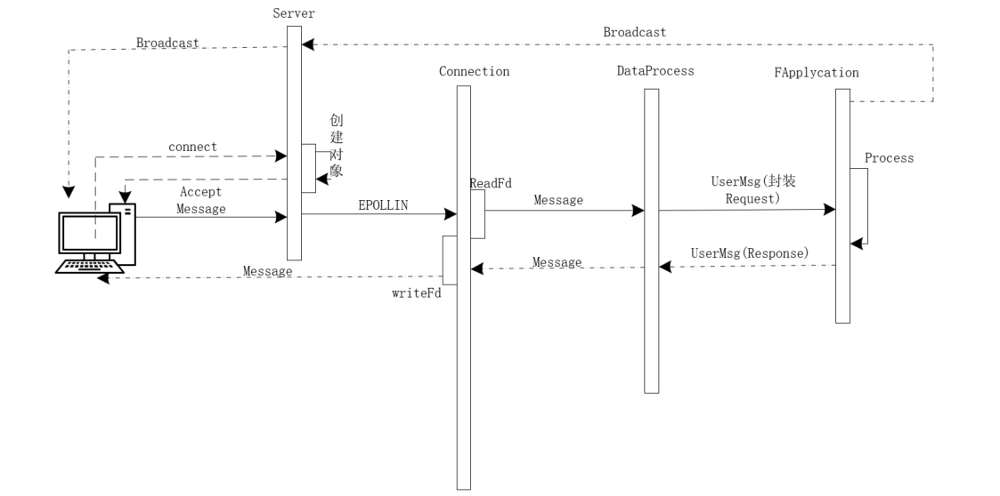

# 目录结构
- **目录结构介绍：**
	- `include`：框架声明的头文件，后续所有的抽象类和继承类头文件
	- `src`:放置框架的源文件
	- `build`:放置框架构建好的文件
	- `test`:放置测试代码
	- `TEST`:放置测试的`debug`文件
	- `client`存放客户端代码
```
.
├── CMakeLists.txt
├── client
├── TEST
├── build
├── include
├── lib
├── src
└── test
```


# 框架介绍
该服务器框架是基于epoll和socket技术的基础上实现的一个并发tcp_server框架。该框架采用三层结构的设计思想，实现服务器对客户端请求处理过程的解耦合。三层结构为连接层`Connections`、数据处理层`DataProcess`和业务应用层`FApplycations`。

此外，还集成了路由功能；配备了封装线程、锁和信号量等调用模块；配备了协程模块和协程调度管理器；配备了定时器Timer模块；支持TCP/HTTP协议。

开发可以基于此框架开发自己的WebServer，也可以通过实现该框架加深对后端知识的理解。

# 三层结构

